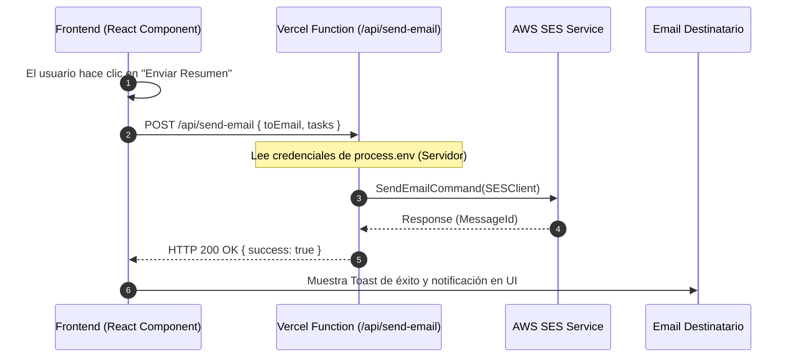

# 📌 Gestor Estratégico de Tareas — MateCode (PI 4)

Aplicación Web SPA de gestión de tareas corporativas con autenticación de usuarios, persistencia en tiempo real en la nube, envío seguro de resúmenes por correo electrónico a través de AWS SES en una función Serverless de Vercel, suite de pruebas automáticas con Vitest y soporte para reordenamiento drag & drop, prioridades y fechas de vencimiento.

Desarrollado para **MateCode** por **Desarrollador/a Full Stack Junior**.

---

## 🚀 Características Principales

- 🔐 **Autenticación Completa & Sesión Persistente**:
  - Registro e inicio de sesión con Email/Contraseña y proveedor **Google Sign-In**.
  - Traducción inteligente de errores de Firebase Auth a mensajes amigables en español.
  - Protección estricta de rutas privadas (`ProtectedRoute`) evitando accesos no autorizados.

- 📋 **Gestión de Tareas (CRUD) por Usuario**:
  - Cada usuario accede de forma aislada a sus propias tareas filtradas por `userId`.
  - Creación con título, descripción opcional, nivel de prioridad (🔴 Alta, 🟡 Media, 🟢 Baja) y fecha de vencimiento.
  - Edición en ventana modal e in situ.
  - Eliminación con confirmación.
  - Marcar como completada/pendiente con actualización visual de progreso.

- 🔄 **Persistencia en Tiempo Real (Cloud Firestore)**:
  - Sincronización instantánea mediante suscripciones `onSnapshot`.
  - Liberación limpia de memory leaks en desmontaje de componentes.

- 🎯 **Extra Credit**:
  - 🔍 **Búsqueda en tiempo real** por palabra clave en título o descripción.
  - 🏷️ **Filtros por Estado** (Todas, Pendientes, Completadas) y por **Prioridad**.
  - 🖐️ **Drag & Drop Reordering**: Reordenamiento interactivo con la librería `@dnd-kit`.
  - 📅 **Alerta de Tareas Vencidas**: Indicadores visuales destacados en rojo para tareas expiradas.

- ✉️ **Notificaciones por Correo Electrónico (AWS SES + Vercel Functions)**:
  - Envío de resumen de tareas consolidado a un clic.
  - Invocación de la Serverless Function `/api/send-email.ts` con plantilla HTML responsiva.
  - **Seguridad garantizada**: Las credenciales de AWS residen **únicamente** en el entorno del servidor y nunca se exponen al navegador.
  - Incluye modo simulación automático para entorno de desarrollo sin llaves activas de AWS.

- 🧪 **Testing Suite (Vitest + React Testing Library)**:
  - Pruebas unitarias de utilidades y formateadores.
  - Pruebas de componentes con mocks de Firebase Auth y Firestore (`TodoForm`, `TodoList`, `ProtectedRoute`).

---

## 📐 Decisiones Arquitectónicas

La estructura del proyecto sigue una arquitectura organizada por capas y principios SOLID:

```text
proyecto-root/
├── api/                        # Serverless Functions (AWS SES Email Handler)
│   └── send-email.ts
├── firestore.rules             # Reglas de seguridad de Firestore
├── src/
│   ├── components/             # Componentes UI reutilizables (common, tasks, layout)
│   ├── contexts/               # Estado global de Autenticación (AuthContext)
│   ├── hooks/                  # Custom hooks (useAuth, useTasks, useToast)
│   ├── pages/                  # Vistas principales (Login, Register, Dashboard, NotFound)
│   ├── routes/                 # Configuración de Router y Rutas Protegidas/Públicas
│   ├── services/               # Clientes de servicios externos (Firebase, TaskService, EmailService)
│   ├── types/                  # Definiciones de TypeScript (Task, Auth, Email)
│   ├── utils/                  # Helpers (Traducción de errores, formateo de fechas)
│   └── test/                   # Suite de Pruebas Unitarias y Componentes + Mocks
├── .env.example                # Plantilla de variables de entorno
├── .gitignore                  # Exclusión estricta de variables sensibles (.env)
├── vitest.config.ts            # Configuración de pruebas Vitest + jsdom
└── README.md                   # Documentación completa del proyecto
```

---

## 🔒 Variables de Entorno

Crea un archivo `.env` en la raíz del proyecto tomando como plantilla `.env.example`:

```bash
# Firebase Client Configuration (Frontend - Variables Públicas)
VITE_FIREBASE_API_KEY=tu_firebase_api_key
VITE_FIREBASE_AUTH_DOMAIN=tu_proyecto.firebaseapp.com
VITE_FIREBASE_PROJECT_ID=tu_proyecto
VITE_FIREBASE_STORAGE_BUCKET=tu_proyecto.appspot.com
VITE_FIREBASE_MESSAGING_SENDER_ID=tu_sender_id
VITE_FIREBASE_APP_ID=tu_app_id

# AWS SES Configuration (Backend Serverless Function - Variables PRIVADAS del Servidor)
# NO usar prefijo VITE_ para evitar que estas claves lleguen al cliente.
AWS_ACCESS_KEY_ID=tu_aws_access_key_id
AWS_SECRET_ACCESS_KEY=tu_aws_secret_access_key
AWS_REGION=us-east-1
AWS_SES_SENDER_EMAIL=noreply@tudominio.com
```

> ⚠️ **IMPORTANTE DE SEGURIDAD**: El archivo `.env` está incluido en `.gitignore` y nunca debe ser subido al repositorio.

---

## 🛠️ Instalación y Ejecución Local

1. **Clonar el repositorio e instalar dependencias**:
   ```bash
   git clone <URL_DEL_REPOSITORIO>
   cd Proyecto\ M4
   npm install
   ```

2. **Configurar las variables de entorno**:
   ```bash
   cp .env.example .env
   # Completa los valores en .env con tus credenciales de Firebase y AWS
   ```

3. **Iniciar el servidor de desarrollo**:
   ```bash
   npm run dev
   ```
   Abre [http://localhost:5173](http://localhost:5173) en tu navegador.

4. **Ejecutar la suite de pruebas (Vitest)**:
   ```bash
   npm run test
   ```

---

## ✉️ Flujo de Envío de Emails (AWS SES + Vercel Functions)



---

## 🤖 Integración de Inteligencia Artificial (IA) en el Proceso de Desarrollo

Durante el desarrollo de esta SPA se integraron herramientas de IA como asistente pair-programming. A continuación se detallan las estrategias, prompts y patrones aplicados:

### Prompts Utilizados & Situaciones Más Efectivas:

1. **Definición de Modelo de Datos y Tipado en TypeScript**:
   - *Prompt*: `"Diseña las interfaces de TypeScript para una aplicación de tareas en React que soporte prioridades, fechas de vencimiento, ordenamiento numérico y filtrado dinámico."`
   - *Resultado*: Creación de `Task`, `CreateTaskInput`, `UpdateTaskInput` y `TaskFilterState` que previenen errores de asignación durante el compilado.

2. **Manejo Amigable de Errores de Firebase Auth**:
   - *Prompt*: `"Crea una función auxiliar en TypeScript que tome los códigos de error estándar de Firebase Auth (ej: auth/wrong-password, auth/invalid-email) y devuelva mensajes claros y comprensibles en español."`
   - *Resultado*: Implementación de `firebaseErrors.ts` mejorando significativamente la experiencia del usuario.

3. **Arquitectura Serverless Segura para AWS SES**:
   - *Prompt*: `"¿Cómo puedo invocar AWS SES desde una aplicación React en Vercel sin exponer mi AWS_SECRET_ACCESS_KEY en el cliente?"`
   - *Resultado*: Creación de la Serverless Function `/api/send-email.ts` con `@aws-sdk/client-ses` y un fallback seguro de simulación en desarrollo.

4. **Pruebas de Componentes con Mocks de Firebase**:
   - *Prompt*: `"Escribe pruebas unitarias con Vitest y React Testing Library para un componente TodoForm y un componente TodoList mockeando las llamadas a Firestore y Auth."`
   - *Resultado*: Implementación rápida de `firebaseMock.ts` y pruebas de integración confiables.

### Descubrimientos y Buenas Prácticas:
- **Separación estricta de capas**: Delegar la lógica de Firestore en `taskService.ts` e independizarla de la UI simplifica el testing.
- **Fail-safe en desarrollo**: Incluir un modo de simulación en las funciones serverless permite continuar trabajando localmente aunque no se disponga de credenciales activas de producción de AWS SES.

---

## 🌐 URL de Despliegue en Producción (Vercel)

- **URL Pública**: 
pim-4-tau.vercel.app
---

## 📜 Licencia & Creditos
Desarrollado para MateCode - Módulo 4 Proyecto Integrador.
